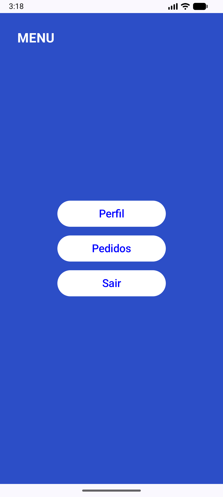

# 📱 Navigation Between Screen

## 📌 Descrição

O projeto demonstra a implementação da navegação entre múltiplas telas em um aplicativo Android, utilizando **Jetpack Compose** e **Navigation Compose**.

##  📸 Prints das Telas

### Tela de Login

### Tela de Menu

### Tela de Perfil

### Tela de Pedidos

